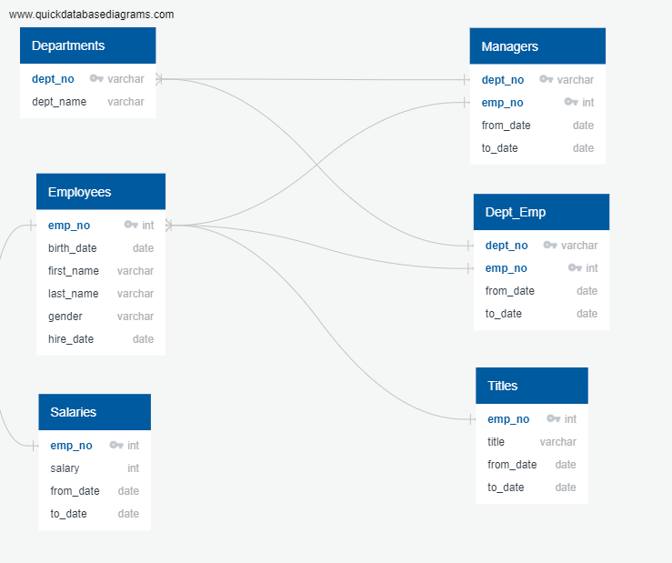
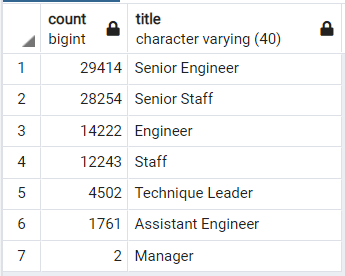

# Pewlett-Hackard_Analysis

## Overview

In this analysis we looked at mock employee data for Pewlett-Hackard and assessed several tables across a database in order to find insights about employees that may be retiring in the next few years. We first created an ERD and then used PostgreSQL to explore the data. 

### ERD

## Purpose
Our objective for this project was to determine the number of retiring employees by title and which employees may be eligible for a mentorship program to ease the impact of the large retiring populaton. 

 ## Results
 We created 4 tables from the data. The first 2 tables were used to find and refine the data for all employees that are eligible for retirement. The third table was a summary of the second table by titles. The fourth table found all employees that would be elligible for a retirement program.

 

From the data we found the following:
- There were several employee duplicates where the employee title was changed but the previous title remained on the list. 
- The largest group of retiring individuals were senior engineers, with 29,414 becoming elligible to retire in the near future.
- Of the +90,000 employees retiring only 2 are listed as Managers.
- There are 7 unique titles that categorize individuals becoming elligible for retirement.
- 1550 employees are eligible for the Mentorship Program under the current requirements.

## Summary
After performing an additional query to count the number of elligible mentorees, it was found that there are only 1550 employees that fit the reccomended criteria. Based on the results, things look almost catastrophic for Pewlett-Hackard. With over 90,000 employees becoming elligible for retirement in the next few years, only having 1550 to replace their positions would leave the company in chaotic darkness. Pewlett Hackard would be taken back to the Stone Age. Not to mention the large impact the company's proprietary technology has on the rest of the globe. This silver wave could quite literally crash world markets, plunging society into total anarchy. Luckily, the suggestions below should assist in avoiding such a predicament. 

- Currently there are about 90,000 positions that will need to be filled over time. Nearly half of the employees retiring are senior engineers or engineers. There are roughly 145,000 engineering employees at the company, so it may help to move more enigineers to senior positions and focus on hiring younger engineers and skilled workers. 
- The current mentorship program requirement only yields about 1550 elligible employees, however they were all born in 1965. Expanding that from 1960 would yeild 93,756 employees that would elligible. This seems much more reasonable. 

## Contact
Email: sean.cary62@gmail.com